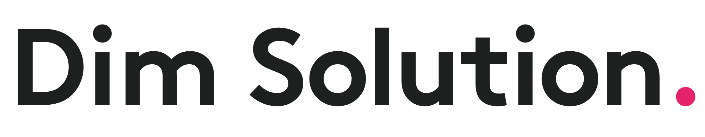
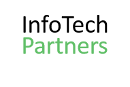
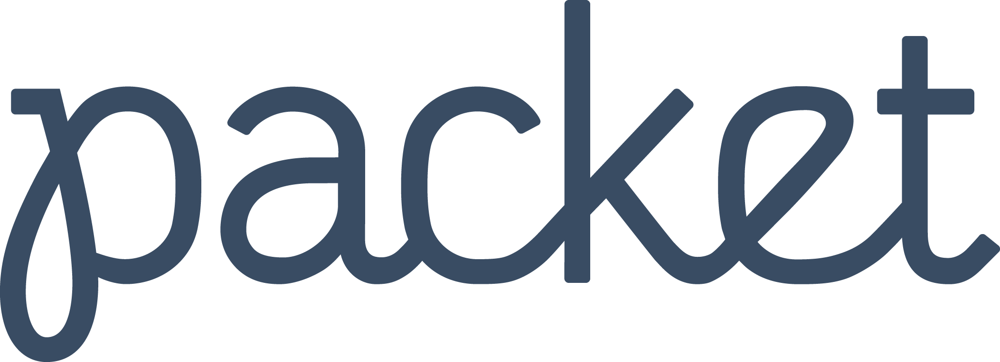
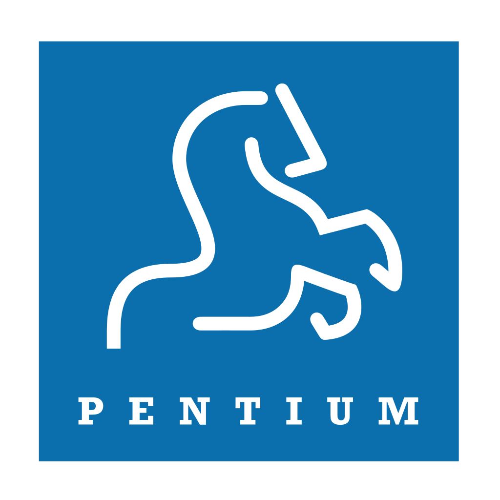
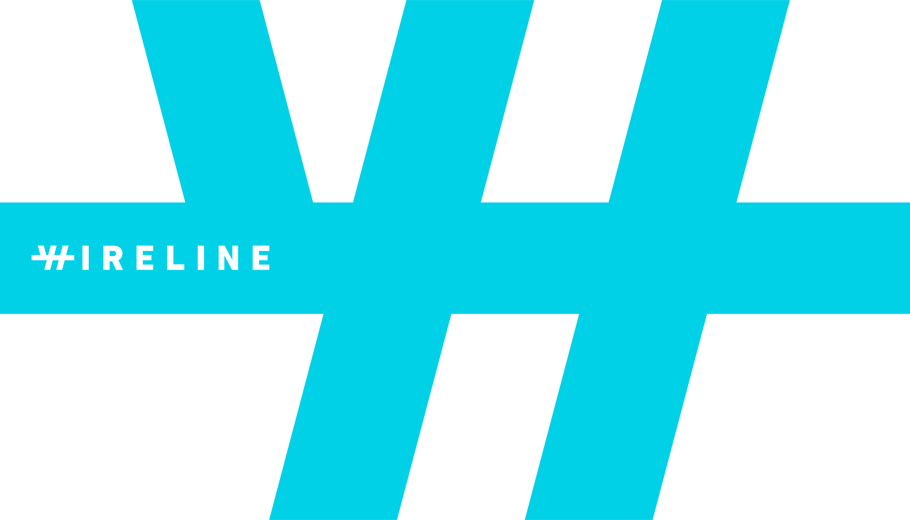

## OpenFaaS - Serverless Functions Made Simple

OpenFaaS (Functions as a Service) is a framework for building serverless functions with Docker and Kubernetes which has first class support for metrics. Any process can be packaged as a function enabling you to consume a range of web events without repetitive boiler-plate coding.

**Highlights**

* Ease of use through UI portal and *one-click* install
* Write functions in any language for Linux or Windows and package in Docker/OCI image format
* Portable - runs on existing hardware or public/private cloud - [Kubernetes](https://github.com/openfaas/faas-netes) and Docker Swarm native
* [CLI](http://github.com/openfaas/faas-cli) available with YAML format for templating and defining functions
* Auto-scales as demand increases

## Governance

OpenFaaS is an independent project created by [Alex Ellis](https://www.alexellis.io) which is now being built and shaped by a growing community of contributors. Project website and blog: [openfaas.com](https://www.openfaas.com).

## Users of OpenFaaS

Some of our users include:

* [VMware](https://www.vmware.com)

To have your company listed as a user [comment here](https://github.com/openfaas/faas/issues/776)

## Get started with OpenFaaS

*Pictured: API gateway portal - designed for ease of use*

Get started with one of our [deployment guides](./deployment/) for Kubernetes or Docker Swarm.

## Presentations

### Digital Transformation of Vision Banco Paraguay with Serverless Functions @ KubeCon late-2018

[HD video co-presenting at KubeCon with Patricio Diaz Senior Analyst, Vision Banco SAECA](https://kccna18.sched.com/event/GraO/digital-transformation-of-vision-banco-paraguay-with-serverless-functions-alex-ellis-vmware-patricio-diaz-vision-banco-saeca)

### Serverless Beyond the Hype (goto Copenhagen) 2018

Overview of the Serverless landscape for Kubernetes, OpenFaaS and OpenFaaS Cloud with live demos and most update information. [View on Android or iPhone](https://gotocph.com/2018/sessions/592)

### TechFieldDay presentation (Dockercon EU) late-2017

15 minute overview with demos on Kubernetes and with Alexa - [HD YouTube video](https://www.youtube.com/watch?v=C3agSKv2s_w&list=PLlIapFDp305AiwA17mUNtgi5-u23eHm5j&index=1)

### OpenFaaS presents to CNCF Serverless workgroup mid-2017

* [Video and blog post](https://blog.alexellis.io/openfaas-cncf-workgroup/)

### Closing Keynote at Dockercon early-2017

Functions as a Service or FaaS was a winner in the Cool Hacks contest for Dockercon 2017.

* [Watch my FaaS keynote at Dockercon 2017](https://blog.docker.com/2017/04/dockercon-2017-mobys-cool-hack-sessions/)

If you'd like to find the functions I used in the demos head over to the [faas-dockercon](https://github.com/alexellis/faas-dockercon/) repository.

**Background story**

This is my original blog post on FaaS from January: [Functions as a Service blog post](http://blog.alexellis.io/functions-as-a-service/)

### Community

OpenFaaS has a thriving community of Open Source contributors and users.

* Find out more on the [community page](/community/) and join the Slack workspace

Have you written a blog about OpenFaaS? Send a Pull Request to the community page below.

* [Read blogs/articles and find events about OpenFaaS](https://github.com/openfaas/faas/blob/master/community.md)

If you'd like to join OpenFaaS community Slack channel to chat with contributors or get some help - then send a Tweet to [@alexellisuk](https://twitter.com/alexellisuk/) or email alex@openfaas.com.

### Contributing

OpenFaaS is written in Golang and is MIT licensed - contributions are welcomed whether that means providing feedback, testing existing and new feature or hacking on the source.

* View the [contributing page](/community/#contribute)

If you would like to contribute to the documentation site or find out more check out the [docs repo](https://github.com/openfaas/docs).

### Grafana dashboards

Example of a Grafana dashboards linked to OpenFaaS showing auto-scaling live in action: [here](https://grafana.com/dashboards/3526)

An alternative community dashboard is [available here](https://grafana.com/dashboards/3434)
